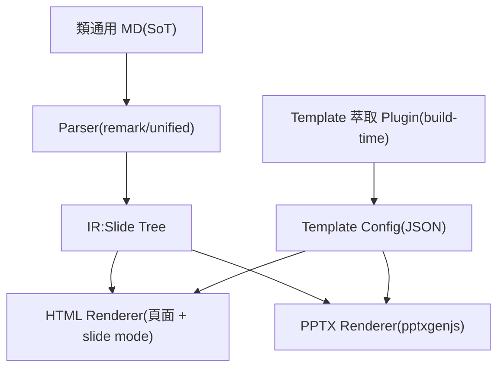

# 定位與問題

## 產品定位
<!-- emphasis -->
Markdown 的「分享與簡報層」,不是編輯器。

貼上一份類通用 Markdown,十秒內得到三種產出:

- **設計感網頁**:可直接分享的頁面連結
- **HTML slide**:全螢幕、鍵盤翻頁、可直接開會
- **可編輯 pptx**:套用企業官方 template

<!-- notes: 開場強調不做編輯器,只做「寫完之後」到「拿去報告」的最後一哩 -->

## 市場缺口
- **HackMD / CodiMD**:協作編輯為核心,slide 陽春,無企業 pptx 輸出
- **Marp / Slidev**:pptx 是整頁圖片不可編輯,企業場景不可用
- **Notion**:分享體驗好,但內容鎖進平台、無法自架

<!-- notes: 市場不缺編輯器,缺的是寫完之後到分享報告之間的落差 -->

## 企業三大硬需求
1. 輸出的 pptx 必須可編輯,主管會改兩個字再轉發
2. 必須套用公司官方 template
3. 內網資安環境,需可自架或純前端

<!-- notes: 這三點就是差異化所在,MVP 驗收即以此三點為準 -->

## 目標用戶
- **企業工程師與 PM**:LLM 產出週報提案,需快速簡報或轉 pptx
- **LLM 工作流**:依 skill 產出合規 MD,一鍵變頁面與簡報
- **知識分享者**:把筆記變成正式頁面連結傳給同事

<!-- notes: 非目標:精雕動畫版面的設計師、需要即時多人協作的團隊 -->

# 核心設計

## 設計原則
- **MD 唯一 SoT**:網頁、slide、pptx 都是同一份 MD 的投影
- **類通用 MD**:在 GitHub、Obsidian 打開仍是正常 Markdown
- **確定性渲染**:runtime 不依賴 LLM,可離線、可 diff、可測試
- **設計感內建**:美感來自 design rules,使用者只寫內容

<!-- notes: 補充第五原則 client-side first:Tier-1 純靜態站,資料不出瀏覽器 -->

## 系統架構

<!-- notes: LLM 只在 build-time 介入:template onboarding 與 authoring,runtime 完全確定性 -->

## 三大資料結構
- **MD Profile Spec**:frontmatter 與 directive 詞彙表,同時是 LLM skill 核心
- **IR(Slide Tree)**:與呈現無關,每頁帶 layout intent 與 typed 內容塊
- **Template Config**:色票、字型、layout 座標、design rules,純 JSON

<!-- notes: config 產出後 runtime 完全不需要 LLM,一家企業一份 -->

# 分階段交付

## 五個階段
1. Phase 0:MD Profile Spec 與 SKILL.md,規格先行
2. Phase 1:純前端 MVP,驗證核心體驗
3. Phase 2:企業 template 萃取 plugin
4. Phase 3:LLM 藝術指導 pass,選配
5. Phase 4:server tier,高保真與生態

<!-- notes: 每階段都有明確驗收與非目標,規格先行是關鍵 -->

## Phase 0 規格先行
- **MD Profile v1**:frontmatter schema、directive 詞彙表上限 8 個
- **SKILL.md v1**:教 LLM 產出合規 MD,含正反例
- **黃金樣本 10 份**:週報、提案、技術分享,後續驗收基準

<!-- notes: 驗收:GitHub 上 directive 隱形、LLM 產出通過 profile linter -->

## Phase 1 前端 MVP
- **貼上式 editor**:CodeMirror 即時 preview,定位是貼上點
- **雙輸出**:HTML 頁面與 slide mode、瀏覽器內產可編輯 pptx
- **內建 template**:2–3 套通用款,附確定性 design rules v1
- **Mermaid 支援**:HTML 內嵌 SVG,pptx 轉 PNG,自動吃色票

<!-- notes: 驗收:10 份黃金樣本全過、pptx 開啟零損毀、貼上到下載少於 30 秒 -->

## Phase 2 企業萃取
- **自動萃取器**:解析 theme 與 layout XML,自動完成約八成
- **LLM 語意標註**:看縮圖對應 layout intent,生成專屬 design rules
- **Onboarding UI**:上傳、預覽、人工微調、存為純 JSON config

<!-- notes: 驗收:一套 template onboarding 含微調少於 1 小時、企業使用者認可像官方簡報 -->

## Phase 3 與 4
<!-- layout: two-col -->

**Phase 3 AI 藝術指導**

- LLM 只輸出 directive 註解寫回 MD,不產 HTML
- 站內 AI 潤飾按鈕,可設定不啟用
- 潤飾輸出 100% 通過 linter

<!-- split -->

**Phase 4 Server Tier**

- .potx 高保真填充,掛在客戶 slide master 之下
- Kroki 整合 PlantUML 等,內網可用
- 短連結、權限、docker-compose 自架

<!-- notes: 多人即時協作編輯是永久非目標,那是 HackMD 的戰場 -->

# 指標與風險

## 核心體驗指標
10 秒內,從貼上到開始簡報。

<!-- notes: 北極星:每週貼上到產出完成次數;pptx 下載少於 30 秒、開啟零損毀 -->

## 成功指標
- **北極星**:每週「貼上 → 產出」完成次數
- **企業端**:onboarding 少於 1 小時、官方感認可率
- **生態端**:LLM 依 skill 產出直接通過 linter 的比例

<!-- notes: Phase 3 另看 AI 潤飾採用率與盲測偏好率 -->

## 主要風險
- **pptxgenjs 限制**:無法載 .potx 且已知坑多,集中 generator 層加回歸測試
- **版面落差**:HTML 與 pptx 不承諾像素一致,directive 只表達意圖
- **採用質疑**:差異化釘死可編輯 pptx、企業 template、可自架三點
- **DSL 膨脹**:directive v1 上限 8 個,新增需兩個真實樣本佐證

<!-- notes: 溢版風險靠瀏覽器端 DOM 量測,export 前自動縮放降級或警告 -->

## 開放問題
<!-- skip -->
1. 產品名稱與 OSS 及商用授權策略
2. Template config 是否公開為開放規格
3. Slide runtime 自製或基於 reveal.js
4. IR 是否對外暴露給第三方 renderer
5. 中英混排的字級行高規則需獨立驗證

<!-- notes: 附錄頁,不進投影片 -->