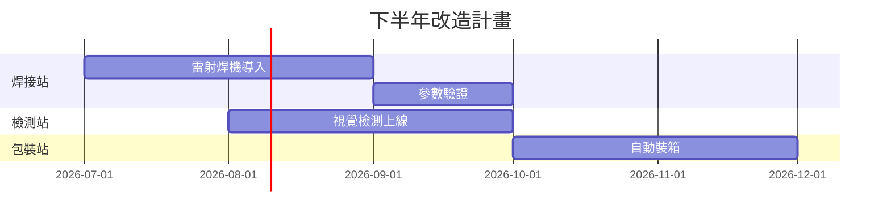

## 本月摘要

- **產量**:雙層真空瓶 8.2 萬支,達成率 103%
- **品質**:直通率 94.1%,連續三個月站上 94%
- **交期**:準時出貨率 98.7%,無重大客訴

<!-- notes: 開場一分鐘帶過,重點在下一頁的良率突破 -->

## 關鍵數字

94.1% 直通率,創產線改線以來新高

<!-- notes: 對比去年同期 89.3%,主因是焊接參數標準化 -->

## 不良柏拉圖

| 不良項目 | 件數 | 佔比 | 對策狀態 |
|---|---|---|---|
| 真空度不足 | 214 | 42% | 封口參數已調整 |
| 外觀刮傷 | 156 | 31% | 治具緩衝墊更換中 |
| 印刷偏位 | 78 | 15% | 定位銷本週到料 |
| 其他 | 61 | 12% | 持續觀察 |

<!-- notes: 真空度不足已收斂,7 月預期降到 30% 以下 -->

## 產線自動化改造時程

<!-- notes: 焊接站改造期間用二線分流,不影響出貨 -->

## 下月行動

1. 完成雷射焊機安裝與教育訓練
2. 視覺檢測系統供應商驗收測試
3. 外觀刮傷對策效果確認,目標降至 20%

<!-- skip -->

## 附錄:各週產量明細

| 週次 | 產量(支) | 直通率 | 加班時數 |
|---|---|---|---|
| W23 | 19,800 | 93.8% | 42 |
| W24 | 20,500 | 94.0% | 38 |
| W25 | 21,200 | 94.3% | 35 |
| W26 | 20,600 | 94.2% | 31 |
