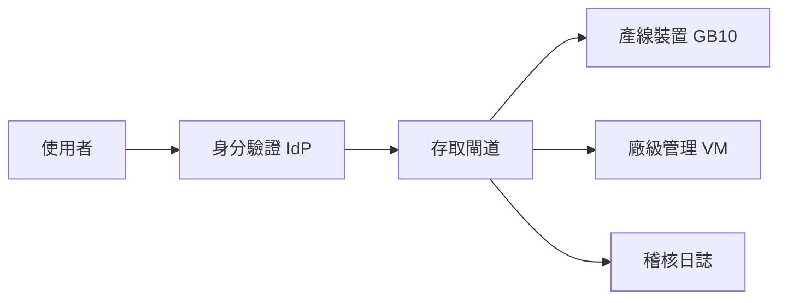
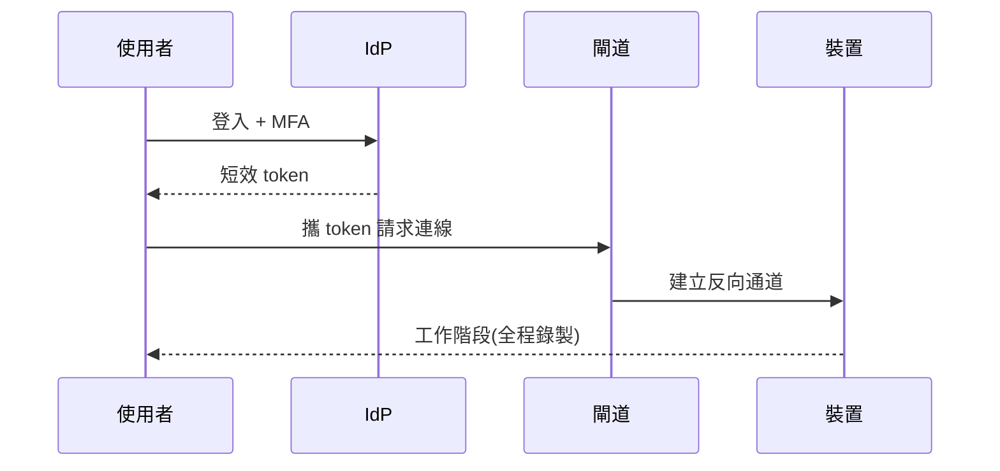

## 為什麼要換掉 VPN

- **攻擊面**:VPN 進來就是整段內網,橫向移動無阻攔
- **維運**:憑證與帳號生命週期分散在三套系統
- **稽核**:連線紀錄只到 IP 層,對不到人與行為

<!-- notes: 先講痛,下一頁才上架構圖 -->

## 目標架構

<!-- notes: 重點是所有連線都收斂到閘道,裝置端不開任何 inbound port -->

## 連線建立流程

## 遷移步驟

1. 閘道與 IdP 上線,與 VPN 並行
2. 新裝置一律走閘道
3. 既有裝置分廠區批次切換
4. VPN 降為緊急備援,六個月後除役

<!-- fit -->

## 兩種方案比較

| 面向 | 續用 VPN | 零信任閘道 |
|---|---|---|
| 最小權限 | 網段級 | 裝置級 |
| 稽核粒度 | IP/流量 | 人/指令/工作階段 |
| 裝置 inbound port | 需要 | 不需要 |
| 導入成本 | 低 | 中 |
| 憑證管理 | 三套系統 | 集中於 IdP |

<!-- notes: 表格資訊密度高,這頁允許縮字;口頭只講「稽核粒度」那一列 -->

## 一句話總結

> 不是把牆加高,而是把每一次連線都變成一次授權。

<!-- notes: 收尾頁,停在這裡開放提問 -->
