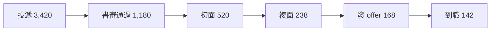

## 上半年人力全貌

- **編制**:期末在職 1,240 人,淨增 86 人
- **離職率**:年化 11.2%,低於同業中位數 14.5%
- **招募**:錄取 142 人,平均到職週期 34 天

<!-- notes: 三個指標都健康,但工程職缺的到職週期是隱憂,下面展開 -->

## 最需要正視的數字

52 天,資深工程師平均到職週期,是全職類最長

<!-- notes: 同業約 45 天;瓶頸在主管面談排程,不在候選人數量 -->

## 招募漏斗

<!-- notes: offer 接受率 85% 很好;書審到初面掉最多,JD 關鍵字要修 -->

## 離職原因分析

| 原因 | 人數 | 佔比 | 可控性 |
|---|---|---|---|
| 職涯發展受限 | 24 | 35% | 高 |
| 薪酬競爭力 | 18 | 26% | 中 |
| 家庭與健康 | 14 | 20% | 低 |
| 主管管理風格 | 13 | 19% | 高 |

<!-- notes: 可控性高的兩項合計 54%,是下半年方案的靶心 -->

## 下半年三項方案

1. 內部轉調雙軌制上線,轉調媒合會每季一場
2. 關鍵職位薪酬帶對標,10 月完成調整
3. 新任主管 90 天教練計畫,涵蓋全部 28 位

<!-- notes: 預算已核,量化目標:年化離職率壓到 10% 以下 -->

<!-- skip -->

## 附錄:各部門離職率

| 部門 | 在職 | 半年離職 | 年化率 |
|---|---|---|---|
| 研發 | 420 | 26 | 12.4% |
| 業務 | 310 | 21 | 13.5% |
| 製造 | 340 | 14 | 8.2% |
| 幕僚 | 170 | 7 | 8.2% |
