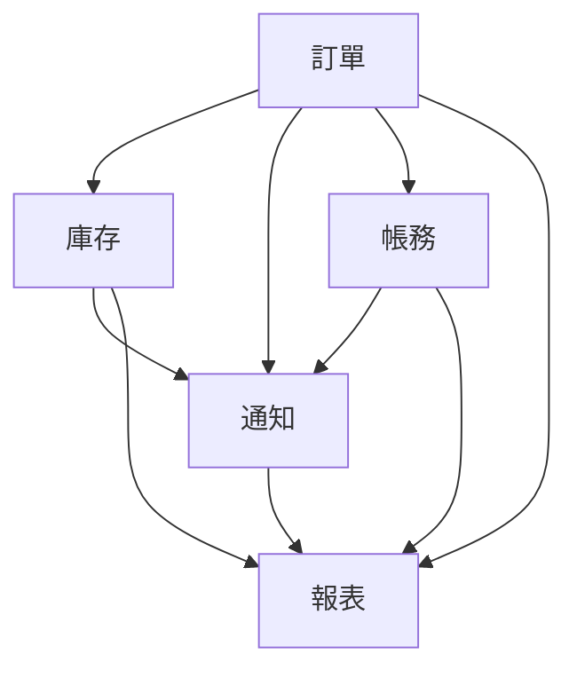
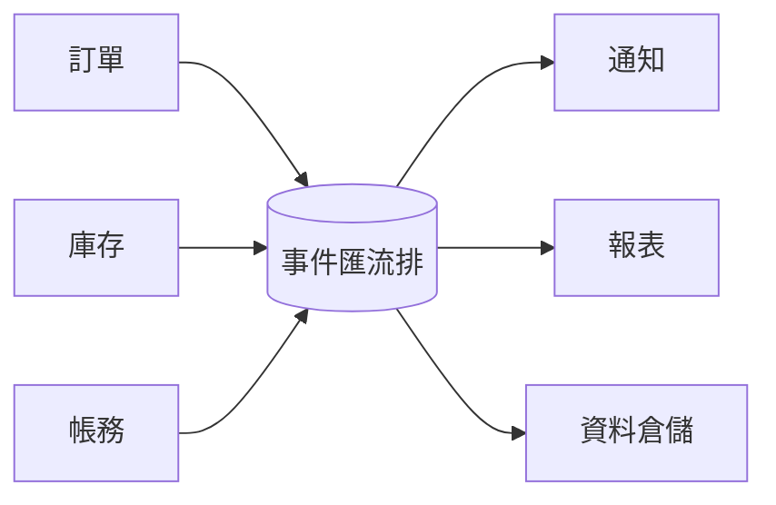
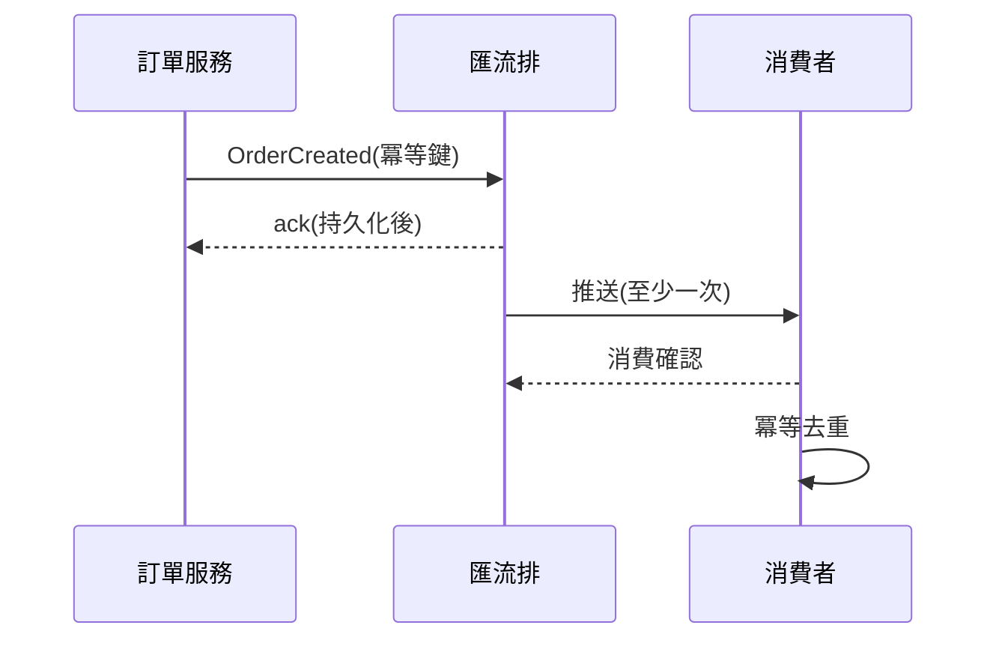

# 現況

## 服務間耦合已成瓶頸

- **點對點呼叫**:14 個服務、41 條直連依賴
- **重試風暴**:下游抖動放大為全鏈路事故
- **新需求**:每接一個消費方要改動上游程式

<!-- notes: 41 條依賴是上個月盤點的結果,圖在下一頁 -->

## 依賴現況

<!-- notes: 只畫了核心 9 條,實際 41 條;重點是報表誰都連 -->

# 提案

## 目標架構

<!-- notes: 生產者只管發事件,消費者自行訂閱,新增消費方零上游改動 -->

## 事件流轉

## 設計決策

- **投遞語意**:至少一次 + 消費端冪等,不做恰好一次
- **順序保證**:僅同一聚合根內有序,以分區鍵實現
- **事件契約**:schema registry 管理,相容性檢查進 CI

## 導入計畫

1. 匯流排與 registry 上線,先接報表讀路徑
2. 訂單事件雙寫,消費方逐一切換
3. 直連依賴每季遞減目標入 OKR
4. 舊直連全部下線,保留緊急旁路

<!-- notes: 雙寫期預計一季,風險最低的切法 -->

## 決策請求

<!-- emphasis -->

本次請求核准:匯流排選型定案與兩名工程師投入首季導入。
