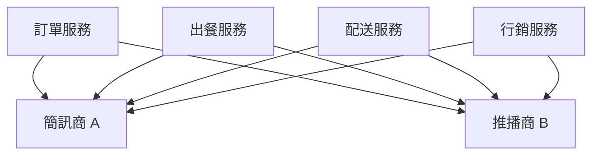
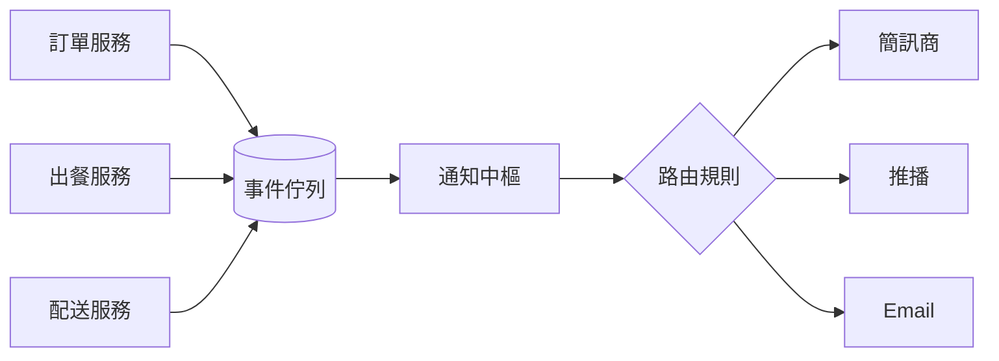
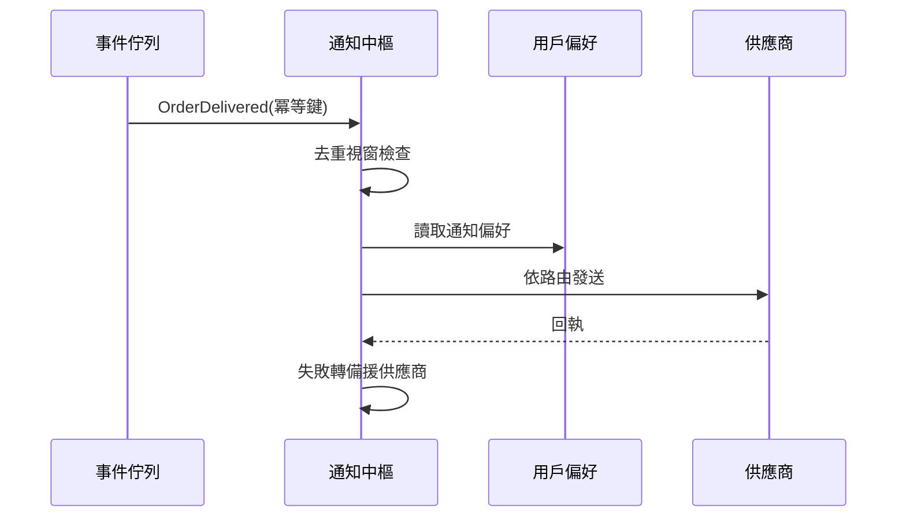

# 現況

## 為什麼要重構

- **延遲**:尖峰時段推播延遲 P95 達 45 秒,客訴主因
- **耦合**:六個服務直連簡訊/推播供應商,改供應商要改六處
- **重複**:同一訂單事件最多觸發三則重複通知

<!-- notes: 45 秒是外送場景不可接受的數字,騎手都到門口了通知才響 -->

## 現行架構

<!-- notes: 每個服務各自實作重試與模板,行為不一致是重複通知的根因 -->

# 提案

## 目標架構

<!-- notes: 通知中樞統一去重、模板、頻控與供應商容錯移轉 -->

## 通知決策流程

## 方案比較

<!-- layout: two-col -->

**自建通知中樞**

- 完全掌控路由與去重邏輯
- 與內部用戶偏好深度整合
- 預估 2 人 × 3 個月

<!-- split -->

**採購 SaaS 方案**

- 上線快,約三週完成串接
- 用戶偏好需雙向同步,有一致性風險
- 年費約自建成本的 1.4 倍

<!-- notes: 建議自建:通知偏好是核心體驗,不宜外包決策邏輯 -->

## 預期效益

- **延遲**:推播 P95 從 45 秒降到 3 秒內
- **去重**:同事件重複通知歸零
- **維運**:供應商切換由改碼變為改設定

## 導入步驟

1. 通知中樞與事件佇列上線,行銷通知先行
2. 訂單三事件切換,雙發驗證兩週
3. 全量切換,舊直連路徑下線

<!-- notes: 行銷通知量大但容錯高,適合當白老鼠 -->

<!-- skip -->

## 附錄:容量估算

| 項目 | 尖峰值 | 設計餘裕 |
|---|---|---|
| 事件量 | 1,200/s | 3x |
| 推播吞吐 | 900/s | 4x |
| 去重視窗 | 10 分鐘 | 記憶體內 + 落盤 |
