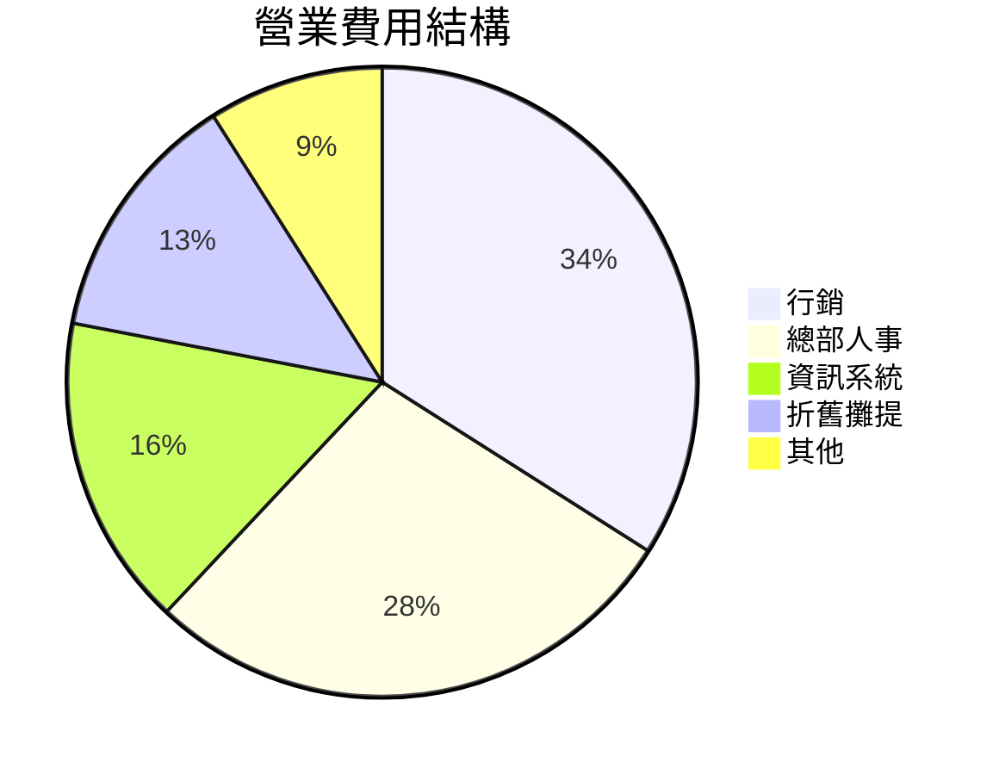

# 損益結構

## 年度損益速覽

- **營收**:12.6 億,年增 14%
- **毛利率**:58.3%,較去年下滑 1.8 個百分點
- **營業利益率**:9.2%,守住兩位數邊緣

<!-- notes: 營收成長但毛利下滑,剪刀差是今天的主題 -->

## 最關鍵的數字

1.8 個百分點,原物料上漲吃掉的毛利

<!-- notes: 其中乳製品貢獻一半;鎖價合約 Q3 到期,要提前談 -->

## 成本結構變化

<!-- fit -->

| 成本項 | 今年佔比 | 去年佔比 | 變化 |
|---|---|---|---|
| 原物料 | 41.7% | 39.9% | +1.8pp |
| 人事 | 24.3% | 24.1% | +0.2pp |
| 租金 | 11.8% | 12.4% | -0.6pp |
| 水電物流 | 7.4% | 7.0% | +0.4pp |
| 其他 | 5.6% | 5.8% | -0.2pp |

<!-- notes: 租金下降來自兩個商場改抽成制,是談判範本 -->

## 費用分佈

<!-- notes: 行銷佔比連兩年上升,ROI 檢核機制下一頁 -->

# 資金與行動

## 現金水位

- **期末現金**:4.2 億,約當 3.8 個月營運支出
- **負債比**:31%,授信額度動用不到兩成
- **資本支出**:1.1 億,八成投入新店與設備更新

<!-- notes: 水位健康,擴張速度不是資金問題而是展店品質問題 -->

## 明年三項財務行動

1. 乳製品與糖鎖價合約重談,目標壓回 0.8 個百分點
2. 行銷費用改零基預算,每案附 ROI 追蹤
3. 建立門市四級評等,末段班改造或退場

<!-- notes: 三項各有量化目標,季度財報會追蹤 -->

## 給經營團隊的提醒

> 成長掩蓋的問題,會在成長放緩的那一季全部到期。
> — 財務長年度總結

<!-- skip -->

## 附錄:季度毛利率走勢

| 季度 | 營收(億) | 毛利率 | 營業利益率 |
|---|---|---|---|
| Q1 | 2.9 | 59.1% | 9.8% |
| Q2 | 3.1 | 58.6% | 9.5% |
| Q3 | 3.2 | 58.0% | 9.0% |
| Q4 | 3.4 | 57.7% | 8.7% |
