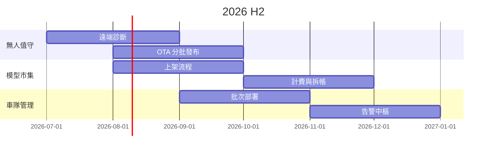

# 主軸

## H2 三個賭注

- **無人值守**:遠端維運能力補齊,讓駐點人力歸零
- **模型市集**:第三方模型上架與計費,打開軟體收入
- **車隊管理**:百台級裝置的批次部署與監控

<!-- notes: 三個賭注對應三種客戶:既有大客戶、ISV、新的連鎖場景 -->

## 時程總覽

<!-- notes: 灰色地帶是計費,依賴財務系統 API,已在對齊 -->

# 各賭注

## 無人值守

- **7 月**:遠端診斷代理進試產批
- **8 月**:OTA 分批發布與自動回滾
- **9 月**:駐點巡檢改為遠端週檢,試點兩客戶

## 模型市集

<!-- layout: two-col -->

**對 ISV**

- 上架自助化,審核 SLA 三個工作天
- 沙箱裝置雲端租用
- 收入拆帳月結

<!-- split -->

**對終端客戶**

- 站內一鍵試用,按日計費
- 模型效能分級標示
- 一鍵回退已購版本

## 北極星

30 台以上車隊客戶數,H2 目標 8 家

<!-- notes: 目前 3 家,pipeline 裡有 11 家在談 -->

<!-- skip -->

## 附錄:依賴與風險

| 項目 | 依賴 | 風險等級 |
|---|---|---|
| 計費拆帳 | 財務系統 API | 高 |
| OTA 回滾 | 分區儲存改版 | 中 |
| 告警中樞 | 監控平台 v3 | 低 |
