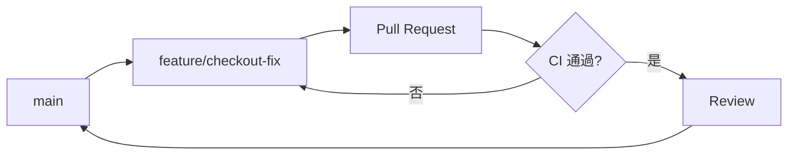

# 概念

## 為什麼需要分支策略

- **並行**:多人同時開發互不阻塞
- **可回溯**:每個變更有脈絡、可回退
- **可發布**:隨時有一條可上線的乾淨主線

<!-- notes: 問學員:你們現在怎麼開分支?收 2-3 個答案再往下 -->

## 一條主線的心智模型

> 主線永遠可發布;所有工作在短命分支上完成,快進快出。

<!-- notes: 這句是整堂課的錨,後面所有規則都推回這句 -->

# 實作

## 分支流程

## 日常操作步驟

1. 從 main 切出 feature 分支
2. 小步提交,訊息寫「為什麼」
3. 推上遠端開 PR,CI 自動跑
4. Review 通過後 squash 合併
5. 刪除已合併分支

<!-- notes: 現場 demo 一輪,學員跟著做 -->

## 常見錯誤

- **長命分支**:超過三天不合併,衝突機率倍增
- **巨型 PR**:超過 400 行,review 品質崩壞
- **直推主線**:繞過 CI 與 review,事故常客

<!-- notes: 每一條都配一個真實事故案例講 -->

## 檢核表

- [x] main 受保護,禁止直推
- [x] PR 必須綠燈才可合併
- [ ] 合併後自動刪分支
- [ ] 主線壞掉時的凍結規則

<!-- notes: 前兩項多數團隊有,後兩項是今天回去要補的作業 -->

<!-- skip -->

## 附錄:指令速查

| 動作 | 指令 |
|---|---|
| 切分支 | `git switch -c feature/x` |
| 更新基底 | `git fetch && git rebase origin/main` |
| 互動整理 | `git rebase -i origin/main` |
| 刪除遠端分支 | `git push origin --delete feature/x` |
