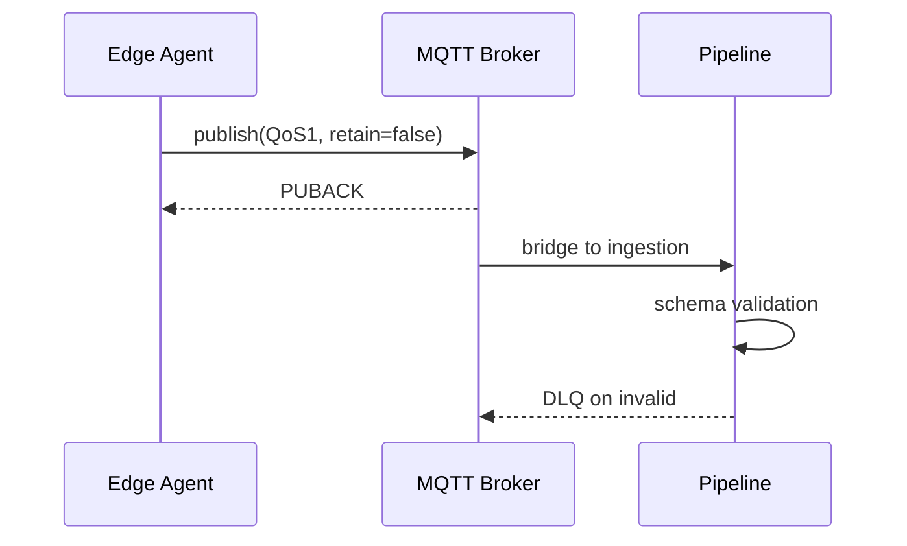

## Scope

- **上報通道**:MQTT over TLS 1.3,單向 outbound
- **資料類別**:heartbeat、metrics、event 三類 topic
- **降級行為**:離線時本地 ring buffer 暫存 72 小時

<!-- notes: 中英混排文件,術語保留英文、敘述用中文 -->

## Topic 結構

```
telemetry/{site_id}/{device_id}/heartbeat
telemetry/{site_id}/{device_id}/metrics
telemetry/{site_id}/{device_id}/event
```

<!-- notes: site_id 對應廠區,device_id 出廠燒錄不可變 -->

## Payload 約定

<!-- layout: two-col -->

**Envelope(必填)**

- `schema_ver`:語意化版本,破壞性變更進位 major
- `ts`:UTC epoch ms,由裝置端打點
- `seq`:單調遞增,斷線重連不歸零

<!-- split -->

**Metrics body**

- `cpu_pct` / `mem_pct`:0–100 float
- `gpu_util`:無 GPU 時省略欄位,不送 null
- `temp_c`:攝氏,一位小數

## 上報頻率

- **heartbeat**:30s 固定,jitter ±3s
- **metrics**:60s,可由平台下行調整至 10s–300s
- **event**:即時,重試採指數退避

## 資料流



<!-- notes: QoS1 + 冪等 seq,平台端去重 -->

## Compliance 邊界

<!-- emphasis -->

所有 payload 禁止含 PII;event 內容僅允許機器狀態碼,不得夾帶操作者資訊。

<!-- skip -->

## Appendix:錯誤碼

| Code | 意義 | 處置 |
|---|---|---|
| E1001 | schema 驗證失敗 | 進 DLQ,告警彙整 |
| E1002 | seq 回捲 | 視為重啟,重建 session |
| E1003 | 憑證過期 | 裝置端自動換發 |
